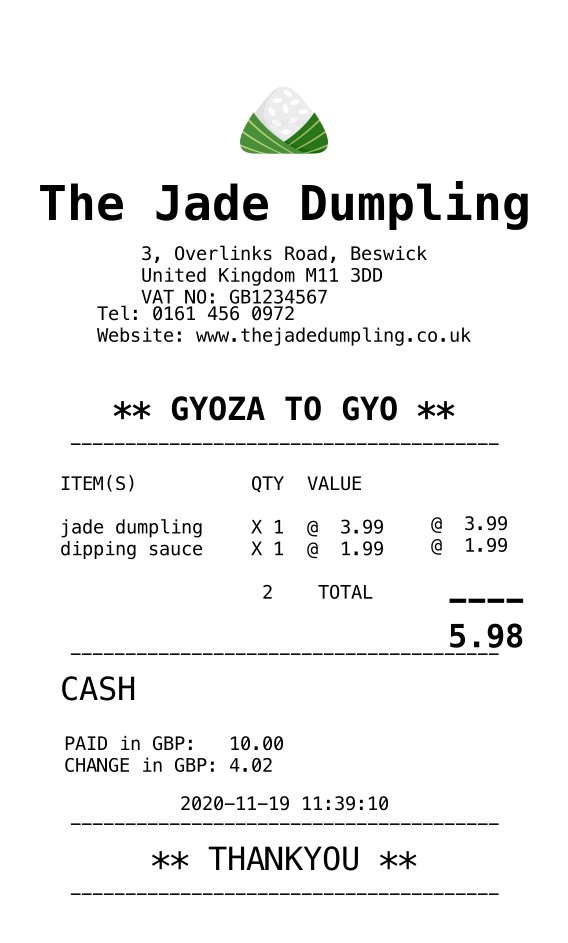

# Receipt Generator #

# A CLI for generating receipt imagery as PNGs

A command line tool used for generating customer receipts as PNGs, intended to be customizable for any shop. The tool accepts information about a customer's purchase as a JSON string and prints it using the [Canvas node module](https://github.com/Automattic/node-canvas). The generated receipt looks like the following:




## Getting Started 

If npm is not yet installed (run 'npm -v' in Terminal to check), run 'npm install' to install. 

See section [How To Use](#how-to-use). 
See section [Tests](#how-to-test). 

# Motivation

To create a CLI that takes command line arguments and outputs imagery. 

It provided the opportunity to write a technical spec, mock up the layout in Indesign and plan & manage tasks using Kanban board in Trello. The project was implemented with the canvas npm module. 


## How To Use 

1. Enter into Terminal:

```javascript
"node src/app.js -o '../src/order_example.json' -n 'The Jade Dumpling' -a '3, Overlinks Road, Beswick' -d 'United Kingdom M11 3DD' -v GB1234567 -b '** THANKYOU **' -i images/close_enough.jpg -p '0161 456 0972' -w 'www.thejadedumpling.co.uk' -t '** GYOZA TO GYO **' 
```

The following are mandatory command line arguments: 
 - order
 - name
 - address1
 - address2
 - vat
 - image  
 
The following command line arguments are optional: 
- phone number
- website
- currency
- locale tag 
- optional top message
- optional bottom message
- output image format 

Run '--help' in Terminal to display options, aliases, accepted data type and descriptions with restrictions. 

2. The CLI will process the passed information and generate a receipt image and save it in the working directory to receipt.png by default. The file location is configurable. 

## Code Style

This project follows standard JS codestyle and contributions should be validated locally with ESLint.

## Tech/Framework Used

- [Node - JS runtime](https://nodejs.org/en/)
- [sizeOf - npm module](https://www.npmjs.com/package/sizeof)
- [canvas - npm module](https://www.npmjs.com/package/canvas) 
- [yargs - node library](https://www.npmjs.com/package/yargs) 
- [shortid - id generator](https://www.npmjs.com/package/shortid)
- [fs](https://nodejs.org/api/fs.html) 

## Features

Business information is passed to the main app.js via command line arguments. 

Order and payment information is passed via a JSON object. The URI for this is passed via the command line. The passed image is resized to be used as a logo. 

There are 3 x classes to support separation of concerns:
- business
- order
     - calculates values such as item quantities, sub-totals and grand total.  
- payment
    - cash payment: calculates the amount of change in the chosen currency 
    - card payment: generates a unique transaction id 

Classes are instantiated in the main app.js file. Class methods are called to validate and reformat the data passed. 

The data is drawn to canvas in text/image elements and written to file. The canvas is sized dynamically and varies depending on the amount of optional information provided. 

The printer has a fixed width of 568 pixels and a margin of 10% on either side.

The final receipt image displays:

- Company logo, address, VAT number 
- Phone number & website (if given)
- Custom messages at the top and bottom of the receipt (if given)

- For each Item: Quantity, Description, Price
- Calculated: quantity total, item subtotals and grand total 

- If cash payment, the Total amount paid and calculated change given 
- If card payment, card details and unique transaction id 

- Date & time stamp, accurate to seconds 

Use of **Continuous Integration** allows for build and automated testing upon git commit. 

<table>
  <tr>
    <td>Initial Mockup of Layout</td>
     <td>Structure of Elements</td>
  </tr>
  <tr>
    <td></td>
    <td> </td>
  </tr>
 </table>

## How To Test

- Run `npm run e2e` in Terminal.

The above runs a shell script for an end to end test as set out in the package.json file. 

## Credits

Thanks to the following resources for debugging wisdom and programming guidance: 

[CLI tutorial](https://developer.okta.com/blog/2019/06/18/command-line-app-with-nodejs)
[Canvas guide](https://flaviocopes.com/canvas-node-generate-image/)

## Additional Work
Features to be added:
- internalisation via locale tags (l18n node module) to support multiple different languages (English, German, Chinese)
- currency to be passed as command line argument. Should have a configurable currency (USD/GBP/Euro is provided as a top-level field in the order information)
- It is possible to configure the tool to output a jpg or pdf. 
- It is possible to configure the location where the receipt is output. 
- The tool should log an error message if command arguments are missing. 
- [testing for CLI via Vorpal.js](https://stackoverflow.com/questions/31223919/how-to-test-nodejs-cli-javascript)
- [testing for CLI generally](https://medium.com/@zorrodg/integration-tests-on-node-js-cli-part-2-testing-interaction-user-input-6f345d4b713a)
- deploying to [npmjs](https://docs.npmjs.com/creating-a-package-json-file)
- unit tests for validation functions