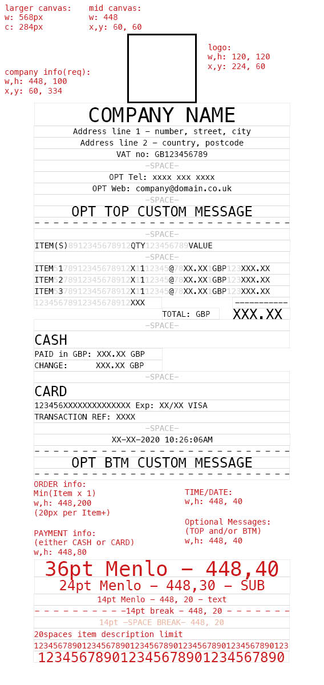
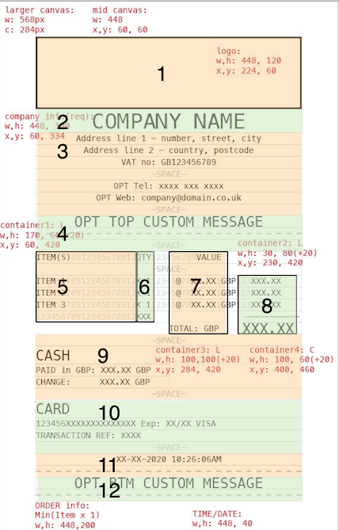

# RECEIPT GENERATOR v1.0 #

# Overview
A Command Line Application for printing receipts to Terminal 

# Glossary
- CLI - Command Line Application 
- [Canvas](https://www.npmjs.com/package/canvas) - Node module for drawing graphics via JS & the HTML canvas element. Implementation of the [Web Canvas API](https://developer.mozilla.org/en-US/docs/Web/API/Canvas_API), as closely as possible. 
- [i18n](https://www.npmjs.com/package/i18n) - Lightweight translation module.

# Product requirements: 
- 1. We will pass a JSON object for the order information with:
    - information for each item: description, quantity, value
    - payment information: if cash - the amount paid, if card - card type, card number, expiry date
- 2. We will pass Business information as individual command line arguments: mandatory: logo, name, address, VAT no. & optional: telephone no. & website  
- 3. The CLI will take other command line parameters:
    - currency (GBP (default), EUR, USD)
    - language (English (default), German, Chinese). Guide [here](https://phrase.com/blog/posts/node-js-i18n-guide/#Adding_an_I18n_provider) 
     - optional bottom message (defaults to none)

- 4. The first layer of the application will validate the input. The second layer will reformat the data and create the image via canvas. 


<figure>
    
    <figcaption>Layout Mockup in Indesign </figcaption>
</figure>

<figure>
    
    <figcaption>Revised with new logo requirements & structure</figcaption>
</figure>

<figure>
    
    <figcaption>Planning HTML elements </figcaption>
</figure>


# Technical requirements: 

Validation of Business Information:
- Logo (--i, -image) - README guide should say for best results, this image should be square. 
- Name (--n, -name) - Should not exceed 20 chars 
- Address Line 1 (--a, -address1) - Number, Street, City should not exceed 53 chars. 
- Addres Line 2 (--b, -address2) - Country & UK Postcode should not exceed 53 chars.  

- VAT no. (--v, -vat) - 9 digits. Contains only digits, except first 2 elements are GB. 
- Telephone number (Optional) (--t, -tel) : 10 or 11 digits. Contains only digits. 
- Website (Optional) (--w, -website) : Max 48 chars. Must contain 'www.' and '.com' or '.co.uk'
- Message (Optional) (--t, -topmessage): Max 30 chars. 

Reformatting of Business Information:
- Image - To be resized to fit (centre-aligned) within logo container of 448 x 120px. See [here](https://codepo8.github.io/canvas-images-and-pixels/index.html) for image manipulation using HTML canvas element. 
- Name - Mapped to CompanyTitle at 36pt Menlo. Centre-aligned. 
- Address Line 1 - Mapped to BusinessInfo at 14pt Menlo: Number, Street, City. Centre-aligned. 
- Address Line 2 - Mapped to BusinessInfo 14pt Menlo: Country, XXX XXX. Postcode formatted with space after first 3 digits. Centre-aligned. 
- VAT no. - Mapped to BusinessInfo no. Centre-aligned.
- Tel (Optional): If provided, mapped to BusinessInfo at 14pt Menlo. Prefix +44, formatted with spaces after 4 digits, and then after the next 3.   
- Website (Optional): If provided, mapped to BusinessInfo at 14pt Menlo. Centre-aligned.
- Custom Message (Optional): If provided, mapped to Web at 24pt Menlo. Centre-aligned. 

Draw the Business Information elements on canvas - seperate elements for the text of separate sizes, [wrapped](https://www.html5canvastutorials.com/tutorials/html5-canvas-wrap-text-tutorial/) and centre-aligned. 

We calculate at this point the total height of the Business Information. This determines the basepoints of the Order information. 

Validation of Order Information (JSON object):
- Description 
- Quantity - < 100
- Value - < 1000.
- Payment type
    - CARD - Number: max length of 16 digits / Expiry: 5 digits. // Look into timestamp UNIX  
    - CASH - <10000. 

```javascript
Order: 
    {
        Items: 
        // TODO: check if this is a good idea to contain objects here in an array? 
            [ 
                {
                    ID: number 
                    Description: "string"
                    Quantity: number 
                    Value: number 
                };
                ...
            ]
        Payment:
            {
                Type: "string"
                Cash: number 
                CardNo: number
                CardExp: "string"
            }
    }
```

Formatting of Order Information:
- Description - Truncate to 19 chars. Add spaces until total length is 20 chars.
- Quantity - If single digit, prefix with space. 
- Value - Formatted to 2dp even if integer. If <10, prefix with a space. XX.XX or %X.XX. 
- Item subtotal (calculate) - Quantity x Value. Formatted to 2dp. <1000. If <100, prefix with a space. %XX.XX or XXX.XX. 

Info for each Item to be concatenated: 
Description[20] + 'X'[1] + Quantity[2] +  space[5] + '@' + space[2] + Value[5] + space[1] + currency[3] + space[3] + subtotal[6]. 
Eg: 
```javascript  
const item1 = "VEG_DUMPLINGS_______" + "X"+ "10" + "_____" + "@" + "__" + "_6.99" + "_" + "GBP" + "___" + "_69.90";

// "VEG_DUMPLINGS_______X10_____@___6.99_GBP____69.90"
```
Check: this should yield a line of 49 chars - entire line is 53 chars. 

- Quantity total (calculate): Quantities added together. 
- Grand Total (calculate): Subtotals added together. Formatted to 2dp.

Draw all Order Items on canvas as a set block of text, wrapped and left-aligned. 
We draw the Total text & figure seperately as these have different horizontal basepoints on the canvas. 
We calculate at this point the height of the Order Items Information as this determines the baseline pt for Payment Information.  

- Payment type
    - CARD - Concatenate card details and map into cardDetails. 
    - CASH - Format to 2dp. If <100, prefix with a space to form 6 digits. Check that this is more than the Grand Total. 
    - CHANGE (calculate) - Grand Total - Cash. Format to 2dp. If <100, prefix with a space to form 6 digits. 

Draw all Payment Items on canvas as a set block of text, wrapped and left-aligned. 
We calculate at this point the height of the Order Items Information as this determines the baseline pt for Date/Time & Optional Message. 

- Date & Time - Map to 14pt Menlo. Centre-aligned. 
- Optional Message - if provided, 30 chars max. Map to 24pt Menlo. Centre-aligned. 

TODO: How to [timestamp](https://stackoverflow.com/questions/221294/how-do-you-get-a-timestamp-in-javascript) for Date/Time accurate to seconds 
Draw remaining Items on canvas as a set block of text, wrapped and centre-aligned. 

# Future Goals
Deploy as a node module to npm 

# Test Plan
Unit tests for validation functions. 
Use end-to-end tests using a shell script to create receipts for all use cases. 
For example, invalid data, with/without optional information, minimum & maximum information. 


